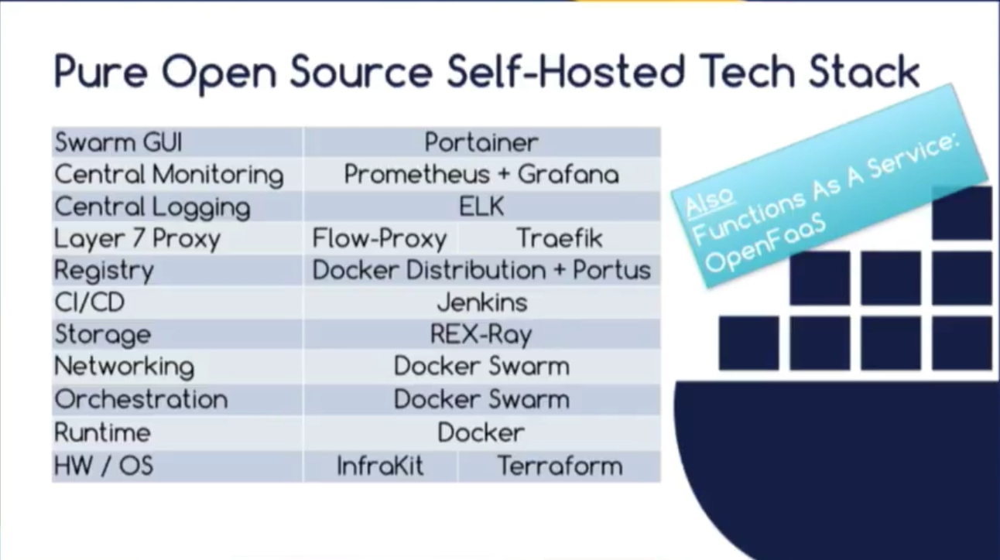
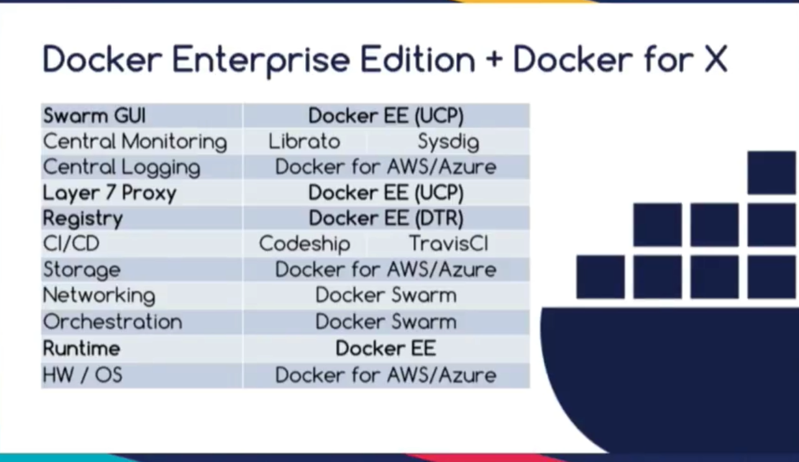

not full ci/cd for first

performance scale
persistent data not too much

12 factor not care too much

1. start it
2. log all stdout/stderr
3. documented file
4. other people
5. lean it
6. scale i t

always put versino number in docker file    

keep all the debuging and installing in the container and leave the host be in it's onw state

outsourcing is good idea in:

1. image registyr
2. logs
3. monitoring and alerting

github.com/cncf/landscape

Docker teah stack  

With docker EE you can cover  

