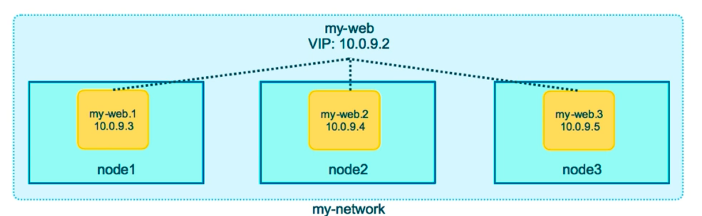
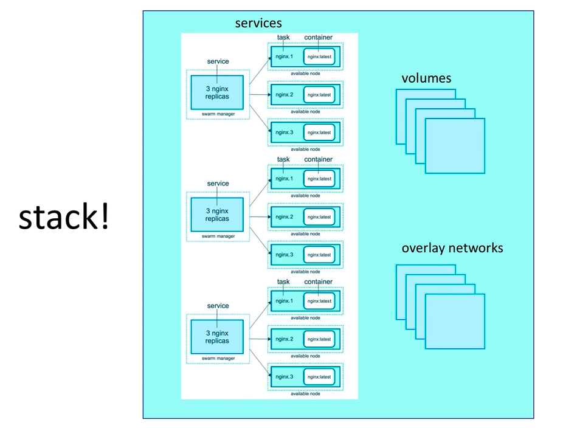

# Docker Swarm

A tool to manage docker engine clusters
it's a different project from docker and have to be enabled with
`$ docker swam init`.  

Checking docker info by

``` bash
$ docker info
...
Client:
 Swarm: active
  NodeID: tnylkte53wnnl4nqn9kmy48wg
  Is Manager: true
  ClusterID: uzvrsyue82df2pldh4vc2g91p
  Managers: 1
  Nodes: 1
  Default Address Pool: 10.0.0.0/8  
  SubnetSize: 24
  Data Path Port: 4789
  Orchestration:
   Task History Retention Limit: 5
  Raft:
   Snapshot Interval: 10000
   Number of Old Snapshots to Retain: 0
   Heartbeat Tick: 1
   Election Tick: 10
  Dispatcher:
   Heartbeat Period: 5 seconds
  CA Configuration:
   Expiry Duration: 3 months
   Force Rotate: 0
  Autolock Managers: false
  Root Rotation In Progress: false
  Node Address: 192.168.1.102
  Manager Addresses:
   192.168.1.102:2377
...
```

The swarm is active after running this command.
Swarm manages (special role for a node) node and services in each node.
Swarm make sure of whole services requirement like number of replicas. manager load balance the number of running containers in each node to achieve the goal state describes in configuration of the swarm.
Connection between different node are TLS encrypted.
`$ docker service create --replicas 3 alpine ping 8.8.8.8` creates three copies of the container in the cluster.


The power of swarm will be shown when we get our cluster running. let's to it.

`$ docker-machine create swarm-node1` will create a node.
here i do it on my local machine with the Virtualbox.
After creating four nodes and ssh to them with
`$ docker-machine ssh swarm-node1` or `$ docker-machine env swarm-node1`
which i don't like!


Now we have to `$ docker swarm init` on the first machine.
On a my virtual machine where there is two network interface,
swarm wants to know the ip to start the swarm on,
this ip use for communication between different workers and managers.
`$ docker swarm init --advertise-addr <ip>`

```bash
docker swarm init --advertise-addr eth1
Swarm initialized: current node (zwcv1s0sosn0b2i7qnx68hnkt) is now a manager.

To add a worker to this swarm, run the following command:

    docker swarm join --token <TOKEN> 92.168.99.103:2377

To add a manager to this swarm, run 'docker swarm join-token manager' and follow the instructions
```

Inturuction are pretty clearn here. i add one other manager and two other worker.
On the manager node we can run `$ docker node ls` and

```bash
ID                            HOSTNAME            STATUS              AVAILABILITY        MANAGER STATUS      ENGINE VERSION
zwcv1s0sosn0b2i7qnx68hnkt     swarm-node1         Ready               Active              Leader              19.03.5
b74juwx5r8iug9b45lfvp9g4d *   swarm-node2         Ready               Active              Reachable           19.03.5
r44na45mch8g5mx6un3ry25rm     swarm-node3         Ready               Active                                  19.03.5
kq65bk7tbrnkw4rxk1056hfw0     swarm-node4         Ready               Active                                  19.03.5
```

Now that we want to create our services on a manager node we can to the following
`$ docker service create --replicas 3 alpine ping 8.8.8.8`
and each node will create a pinger service.
*note that this kind of command only allowed to issue by the manger, not worker*.
We can watch our services.

```bash
$ docker service ls
ID                  NAME                MODE                REPLICAS            IMAGE               PORTS
o1cydgahlota        unruffled_noyce     replicated          4/4                 alpine:latest

$ docker service ps unruffled_noyce
ID                  NAME                IMAGE               NODE                DESIRED STATE       CURRENT STATE           ERROR               PORTS
pyi0wrrcqd41        unruffled_noyce.1   alpine:latest       swarm-node1         Running             Running 3 minutes ago
ikqdhj6omssa        unruffled_noyce.2   alpine:latest       swarm-node3         Running             Running 3 minutes ago
h5zx619iceic        unruffled_noyce.3   alpine:latest       swarm-node4         Running             Running 3 minutes ago
lpwnapu80hgo        unruffled_noyce.4   alpine:latest       swarm-node2         Running             Running 3 minutes ago
```

## Rolling update to a service

1. scale up or down `$ docker service scale <name>=<number>`
2. update the version `$ docker service update  --image <NewImage> <NameOfService>`. This will update the images one by one until all are updated or one failed to update. parallelism is possible.

## Network

With `--driver overlay` can build a bridge across nodes in a swarm network.

Create a docker overlay network with :
`$ docker network create --driver overlay <NAME>`.  
and connect some services to created network with
`$ docker service create --name <NAME> --network <NETWORK_NAME> <IMAGE>`, Now add all the services with overlay network and on the outside it looks like all the services running
on the same subnet.
In a overlay network docker create a virtual ip(VIP) Like showed in the picture blow.

take a note that this load balancer are **Stateless**.

## Docker Stacks

takes the best of the *docker-compose* and *docker swarm*.
Let the dev to use docker compose file in swarm env.  
Note that the swarm is for deploy and not build. so any thing related to build part of the compose file
will be ignored by the swarm stack any anything related to the swarm deploy part will be ignored by the
compose.  
To run a compose file in swarm mode you can just do this.
`$ docker stack deploy -c docker-compose.yml <name>`
The benefits of using a compose file in swarm is that dev can do network, volume services all in one place, and it's
really awesome. isn't it.



many command in form of `$ docker service ls`, `$ docker service ps <name>` works with stack.
and there is some command like `$ docker stack services <name>` which outputs:

```bash
docker stack services voteapp
ID                  NAME                MODE                REPLICAS            IMAGE                                       PORTS
56mge4sievjg        voteapp_worker      replicated          2/2                 bretfisher/examplevotingapp_worker:java
bj6nnmmo7uda        voteapp_result      replicated          1/1                 bretfisher/examplevotingapp_result:latest   *:5001->80/tcp
kovb12p57qkt        voteapp_vote        replicated          2/2                 bretfisher/examplevotingapp_vote:latest     *:5000->80/tcp
l6to5r14l62d        voteapp_db          replicated          1/1                 postgres:9.6
rv5173qgyuad        voteapp_redis       replicated          1/1                 redis:latest
```

### Secrets Storage in Swarm

[Docker Secrets](https://docs.docker.com/engine/swarm/secrets/)
In Raft DB encrypted on disk, created with disk. (Ram FS)
the DB is only on manager nodes.
max size of a secret is 500Kb.
Secrets only can be accessed by the containers that assigned to them.  
Note that docker compose allow the dev to use secrets but it stores them in cleat text.  
Can add secrets with txt file and cmd.
`$ docker secret create psql_user psql_user.txt` # From text  
`$ echo "password" | docker secret create psql_pass -` From env  
And assign the secrets to service.

```bash
$ docker service create --name <name> --secrest psql_user --secret --psql_pass \
-e POSTGRES_PASSWORD_FILE=/run/secrets/psql_pass \
-e POSTGRES_USER_FILE=/run/secrets/psql_user \
<image>
```

If dev rm a secret from a container, the container will redeploy
`$ docker service update --secret-rm <name>`

### Secrets in docker swarm stack

For stack compose file has to be in version 3 but in order to support secrets version 3.1 required.

```yml
version: "3.1"

services:
    psql:
        image: postgres
    secrets:
        - psql_user
        - psql_password
    enviroment:
        POSTGRES_PASSWORD_FILE: /run/secrets/psql_password
        POSTGRES_USER_FILE: /run/secrets/psql_user

secrets:
    psql_user:
        file: ./psql_user.txt
    psql_password:
        file: ./psql_password.txt
```

With creating the docker stack, docker create secrets in compose file automatically

```bash
$ docker stack deploy -c docker-compose.yml mydb
Creating network mydb_default
Creating secret mydb_psql_user
Creating secret mydb_psql_password
Creating service mydb_psql
```

And with removeing them it remove them automaticaly.

```bash
$ docker stack rm mydb
Removing service mydb_psql
Removing secret mydb_psql_user
Removing secret mydb_psql_password
Removing network mydb_default
```

*Note: not all the images support secrets in file in stack
(official images do)*

Secrets can  added via from env to a docker compose file too. from the swarm add the secret.
`$ echo <topsecretpasswd> | docker secret create psql-pw -`. after that the compose file has to be like this.

```yml
version: "3.1"
services:
  postgres:
    image: postgres:12.1
    environment:
      - POSTGRES_PASSWORD_FILE=/run/secrets/psql-pw
    secrets:
      - psql-pw
    volumes:
      - drupal-data:/var/lib/postgresql/data

volumes:
  drupal-data:
  drupal-modules:
  drupal-profiles:
  drupal-sites:
  drupal-themes:

secrets:
  psql-pw:
    external: true
```

In here we use file for the psql password and the file is managed by the docker secret.
note that the `external: true` means the secret will be created from command line by us and
not managed by the stack. this means that the `$ echo ...` command has to be run before the `$ docker stack deploy`.

### Secrets on docker-compose

Secrets are meant for the production environments, but we can run the compose files with secret in them with
*docker-compose*. *docker-compose* allow the developer to use the secret option but it do not encrypt the secret
(it's just a volume mounted to the container) and you can only use the file based secrets. external options is not
available for the docker compose.

### Different config with docker compose and swarm stack

Imagine a file configuration like this.

``` bash
docker-compose.override.yml
docker-compose.prod.yml
docker-compose.test.yml
docker-compose.yml
Dockerfile
psql-fake-password.txt
```

*docker-compose* default config file is `docker-compose.yml` and if the yml file with the name of the
`docker-compose.override.yml` exist in the folder, *docker-compose* will try to apply the new config file
from `docker-compose.override.yml` to the based config `docker-compose.yml` file.  
Running the `$ docker-compose up` it this folder is the same as running
`$ docker-compose -f docker-compose.yml -f docker-compose.override.yml up`.  
So if you need to other config file to merge into each other you can run
`$ docker-compose -f docker-compose.yml -f docker-compose.test.yml up` ( and add the
option `-d` to detach it from the terminal).

For debugging and seeing the config file generated from the to files you can add the `config` option
at the end of the `$ docker-compose -f <file> -f <file>` command.
ex: `$ docker-compose -f docker-compose.yml -f docker-compose.prod.yml config` .

## Swarm service update

There will be time when you need to update your containers. in swarm 
it can be done very easily.  
Swarm will try to update one running container at a time for each update command.
updates will replace the container and image most of the time except when updating
something like labels.  
update command has `-add` and `-rm` option for each configuration.
stack deploy to a same one is an update

some update example:
**newer image**
`$ docker service update --image myapp:1.2.1 <servicename>`
**add env and rm port**
`$ docker service update --env-add NAME=KEY --publish-rm 8000`
**replicas (scale)**
`$ docker service scale web=8 api=9`
**rollback**
`$ docker service rollback <servicename>`
**stack update**
`$ docker stack deploy -c file.yml <servicename>`
*In the stack update is just a new config file and change is responsibility
of the stack to figure out the commands and talking to other APIs*

Swarm can be force to roll an update and balance the running services and their container in
each node.
`$ docker service update web --force`

## Docker Health checks

Health check command works for *docker run*, *docker-compose*, *swarm* and *services*. health check
do a basic health check and it has three state *starting*, *healthy* and *unhealthy*.
health check command execute it self inside the container and runs every 30 seconds.

After an unhealthy state docker run do nothing but swarm try to replace the container.
If a container is unhealthy the updates will not take place.

start piriod  do healty check, don't report 

### Docker run

```bach
docker container --name postgres -d --health-cmd="pg_isready -U postgres || exit 1" postgres
```

### In Dockerfile

```Dockerfile
FROM nginx:1.13

HEALTHCHECK --interval=30s --timeout=3s \
CMD curl -f http://localhost/ || exit 1
```

### docker-compose

```docker-compose.yml
version: "2.1"
services:
    web:
        image: nginx
        healthcheck:
            test: ["CMD", "curl", "-f", "http://localhost"]
            interval: 1m30s
            start_period: 1m  # version 3.4
```

In docker service excpet a healty state to count it as runngin
