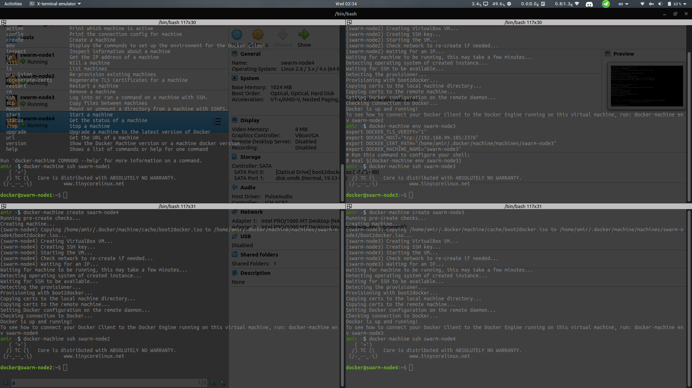

# Docker Swarm

A tool to manage docker engine clusters
it's a different project from docker and have to be enabled with
`$ docker swam init`.  

Checking docker info by

``` bash
$ docker info
...
Client:
 Swarm: active
  NodeID: tnylkte53wnnl4nqn9kmy48wg
  Is Manager: true
  ClusterID: uzvrsyue82df2pldh4vc2g91p
  Managers: 1
  Nodes: 1
  Default Address Pool: 10.0.0.0/8  
  SubnetSize: 24
  Data Path Port: 4789
  Orchestration:
   Task History Retention Limit: 5
  Raft:
   Snapshot Interval: 10000
   Number of Old Snapshots to Retain: 0
   Heartbeat Tick: 1
   Election Tick: 10
  Dispatcher:
   Heartbeat Period: 5 seconds
  CA Configuration:
   Expiry Duration: 3 months
   Force Rotate: 0
  Autolock Managers: false
  Root Rotation In Progress: false
  Node Address: 192.168.1.102
  Manager Addresses:
   192.168.1.102:2377
...
```

The swarm is active after running this command.
Swarm manages (special role for a node) node and services in each node.
Swarm make sure of whole services requirement like number of replicas. manager load balance the number of running containers in each node to achieve the goal state describes in configuration of the swarm.
Connection between different node are TLS encrypted.
`$ docker service create --replicas 3 alpine ping 8.8.8.8` creates three copies of the container in the cluster.


The power of swarm will be shown when we get our cluster running. let's to it.

`$ docker-machine create swarm-node1` will create a node.
here i do it on my local machine with the virtulabox.
After creating four nodes and ssh to them with
`$ docker-machine ssh swarm-node1`  



Now we have to `$ docker swarm init` on the first machine.

```bash
docker swarm init --advertise-addr eth1
Swarm initialized: current node (zwcv1s0sosn0b2i7qnx68hnkt) is now a manager.

To add a worker to this swarm, run the following command:

    docker swarm join --token <TOKEN> 92.168.99.103:2377

To add a manager to this swarm, run 'docker swarm join-token manager' and follow the instructions
```
Inturuction are pretty clearn here. i add one other manager and two other worker.
On the manager node we can run `$ docker node ls` and

```bash
ID                            HOSTNAME            STATUS              AVAILABILITY        MANAGER STATUS      ENGINE VERSION
zwcv1s0sosn0b2i7qnx68hnkt     swarm-node1         Ready               Active              Leader              19.03.5
b74juwx5r8iug9b45lfvp9g4d *   swarm-node2         Ready               Active              Reachable           19.03.5
r44na45mch8g5mx6un3ry25rm     swarm-node3         Ready               Active                                  19.03.5
kq65bk7tbrnkw4rxk1056hfw0     swarm-node4         Ready               Active                                  19.03.5
```

Now that we want to create our services on a manager node we can to the following
`$ docker service create --replicas 3 alpine ping 8.8.8.8`
and each node will create a pinger service.
*note that this kind of command only allowed to issue by the manger, not worker*.
We can watch our services.

```bash
$ docker service ls
ID                  NAME                MODE                REPLICAS            IMAGE               PORTS
o1cydgahlota        unruffled_noyce     replicated          4/4                 alpine:latest       

$ docker service ps unruffled_noyce                                                                                  
ID                  NAME                IMAGE               NODE                DESIRED STATE       CURRENT STATE           ERROR               PORTS
pyi0wrrcqd41        unruffled_noyce.1   alpine:latest       swarm-node1         Running             Running 3 minutes ago                       
ikqdhj6omssa        unruffled_noyce.2   alpine:latest       swarm-node3         Running             Running 3 minutes ago                       
h5zx619iceic        unruffled_noyce.3   alpine:latest       swarm-node4         Running             Running 3 minutes ago                       
lpwnapu80hgo        unruffled_noyce.4   alpine:latest       swarm-node2         Running             Running 3 minutes ago                       
```
